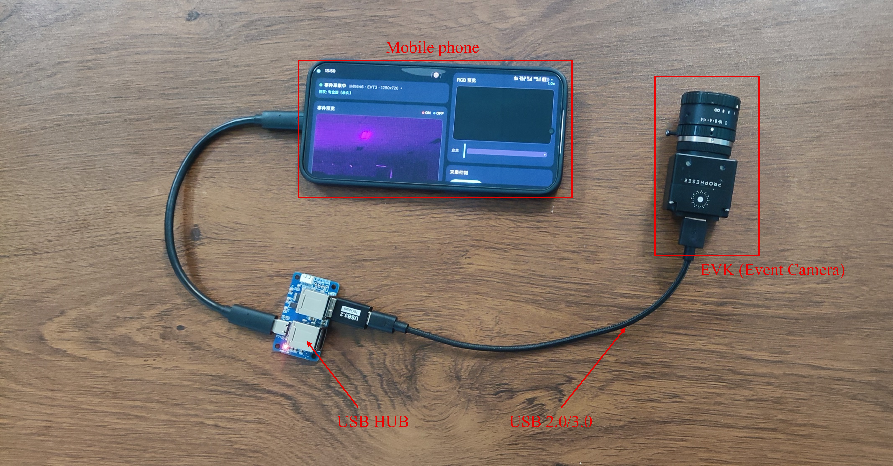
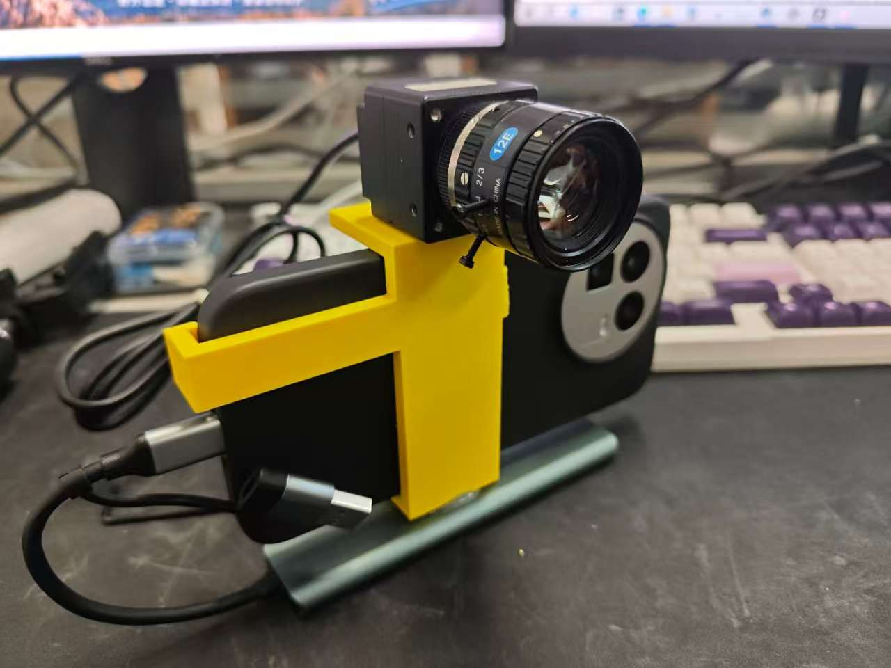

# EVKphone — 事件相机手机采集 App 使用说明

EVKphone 是一款安卓应用,把 Prophesee EVK5 系列事件相机(EVK3/EVK4 亦可)连接到手机上,
**免 root** 即可完成事件数据的实时预览、多模态同步录制与回放。

---

  
  

---

## 一、主要功能

### 1. 实时事件预览
连接相机后即刻显示事件画面:**红色 = ON 事件,蓝色 = OFF 事件**,黑色背景,
旧的痕迹自动淡出。横竖屏都支持(横屏为双栏布局,预览占主区域),旋转屏幕**不会中断**预览。

### 2. 三模态同步录制
一次录制,同时生成 4 个文件(文件名前缀相同):

| 文件 | 内容 |
|---|---|
| `rec_时间.raw` | 事件相机数据(标准 EVT3 格式,PC 端 Metavision 软件可直接打开) |
| `rec_时间_imu.csv` | 手机内置 IMU 数据(加速度计 + 陀螺仪 + 旋转矢量,约 990 Hz,硬件时间戳) |
| `rec_时间.mp4` | 手机后摄像头视频(1080p 30fps,无声) |
| `rec_时间_metadata.json` | 时间同步信息(三种数据如何对齐,详见第四节) |

IMU 与 RGB 摄像头为可选模态,录制前可分别开关;IMU 默认开启。

### 3. 事件文件回放
把 .raw 文件放到手机的 `/sdcard/evk_data/` 文件夹,App 内即可**流畅地 1 倍速实时回放**,
支持暂停、继续、重播、进度条拖动。自己录的文件、PC 端 Metavision 录的文件都能播。

### 4. 坏点屏蔽(传感器级)
在**传感器内部**屏蔽坏点/热像素——被屏蔽的像素**根本不会产生数据**,录制文件、预览、
统计从源头就是干净的(不是事后过滤)。

- 默认已内置 3 个实测坏点坐标,开箱即用;
- 可手动添加坐标(输入 `x,y`)、删除单个点、恢复默认、清空;
- 改动实时生效并自动保存;换用另一台相机机身时,需重新确定坏点坐标后修改。

### 5. RGB 变焦
预览画面支持**双指捏合**或拖动滑条进行数字变焦(倍率实时显示),变焦同时作用于预览和
录制的视频。更换不同焦距的事件相机镜头后,可用它对齐 RGB 与事件相机的视场。

### 6. 事件率控制(ERC)
可调 2M / 10M / 30M / 100M ev/s 四档。USB2 接口的手机**务必保持开启**(默认 10M),
否则高动态场景下数据会溢出;USB3 手机可调高或关闭。

---

## 二、系统要求

| 项目 | 要求 |
|---|---|
| 手机 | 64 位 ARM 安卓手机(arm64-v8a),**Android 11 及以上** |
| 接口 | USB OTG/Host 口(连相机用);仅回放文件不需要 |
| 相机 | Prophesee EVK 系列(EVK2/EVK3/EVK4/EVK5,经 Treuzell 板卡协议连接) |
| 权限 | 「所有文件访问」(读写 evk_data 文件夹);摄像头权限(仅 RGB 模态用) |

**连接提示**:手机直连相机经常枚举失败,请使用 **USB3 集线器/扩展坞**(实测稳定方案);
若相机反复掉线重枚举,优先检查扩展坞供电。USB2 手机建议搭配 ERC 限流使用。

---

## 三、快速上手

1. **安装**:下载 APK 并安装(需允许"未知来源应用");
2. **授权限**:首次打开 → 状态卡点「授权」→ 点「授权访问文件」→ 系统设置里允许;
3. **连相机**:OTG 线/扩展坞连接相机 → App「USB 设备」卡片会列出相机 → 点
   「连接 VID xxxx」→ 授权 USB → 状态变为「事件采集中」,预览出现;
4. **录制**:「采集控制」里选择要录的模态(IMU/相机)→ 点「开始录制」→「停止录制」;
5. **取文件**:手机文件管理器或电脑 MTP 打开 `/sdcard/evk_data/`,所有录制文件都在这里;
6. **回放**:「事件文件」卡片 → 点任意 .raw 的「播放」。

---

## 四、数据文件与时间同步

三路数据通过 `metadata.json` 中的锚点对齐:

- `time_base.unix_minus_monotonic_ns` — 手机开机钟与 Unix 时间的固定偏移;
- `event_camera.record_start_ns / record_start_monotonic_ns` — 录制起点(两种时基);
- `event_camera.first_event_ts_us / last_event_ts_us` — 首末事件的事件钟时间戳(精确到事件级);
- `event_camera.masked_hotpixels` — 本次录制生效的坏点屏蔽坐标;
- `imu.samples / estimated_rate_hz` — IMU 样本数与实际频率;
- `video.start_monotonic_ns / duration_ns` — 视频起点与时长。

**对齐方法**:IMU 与视频天然在手机时钟上;事件钟通过 `record_start + first_event_ts_us`线性映射到手机时钟。

---

## 五、授权与激活

- **14 天全功能试用**:安装后自动开始,到期前或到期后均可激活;

---

## 六、常见问题

**Q:USB 设备列表里看不到相机?**
确认手机 OTG 已开启、扩展坞供电正常;换一个 USB3 集线器再试(直连成功率低)。

**Q:相机连接后又消失、反复出现?**
供电不足或接触不良。检查扩展坞的独立供电;若相机彻底无响应,拔插相机电源重启。

**Q:安装新版本 APK 时要注意什么?**
**务必先在 App 内点「停止并断开相机」再安装**——相机正在出流时被系统强杀,可能把
相机固件卡死(表现为相机不再响应,需要物理拔插恢复)。

**Q:录制的文件太大了**
10M ev/s 时约 37 MB/s(每分钟约 2.2 GB),属正常;可降低 ERC 档位减少数据量。

**Q:IMU 频率只有 200 Hz?**
部分手机系统会限制传感器速率。App 已声明高采样率权限,绝大多数机型可达约 990 Hz。

**Q:RGB 视频分辨率不是 1080p?**
个别机型摄像头能力有限时会自动回落,以实际视频文件为准(metadata 中有说明字段)。

---

## 七、版权与开源许可

本应用 © 2026 作者,保留所有权利,未经许可不得再分发或修改。

内置以下开源组件(随应用分发,谨此致谢):

| 组件 | 许可证 | 说明 |
|---|---|---|
| [OpenEB](https://github.com/prophesee/openeb) 5.2.0 | Apache License 2.0 | 事件相机 HAL/驱动层 |
| [libusb](https://libusb.info) 1.0.30 | GNU LGPL 2.1 | USB 通信(动态链接) |
| AndroidX / CameraX / Jetpack Compose | Apache License 2.0 | Google 官方 UI/相机框架 |

各许可证全文见项目内对应目录。
